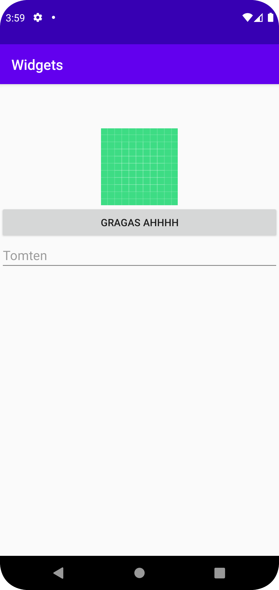

# Rapport


Programkod ska se ut som exemplet nedan. Koden måste vara korrekt indenterad då den blir lättare att läsa vilket gör det lättare att hitta syntaktiska fel.


Jag skapade en LinearLayout 
1. adderade imageview för att ska en bild på appen och sedan ändrade jag positionen på den till mitten för att det skulle se
   bättre ut. Jag adderade image med hjälp av activity main där man kan justera imagen och desamma med text och knappen. 

2. adderade button för att skapa en knapp på appen där det står GRAGAS AHHHH, inget händer om man trycker på den. Jag även ändrade positionen
på knappen till mitten för att den skulle vara positionerad med imagen.

3. addera edittext för att placera en text på appen för att skapa en box där man kan skriva saker och ting. Jag placerade också den i mitten
under knappen och imagen. 

4. Adderade margin på alla element där det är margin left 48 för att få de att röra sig mott vänster. 
```

    <ImageView
        android:id="@+id/imageView3"
        android:layout_width="match_parent"
        android:layout_height="62dp"
        android:contentDescription="his logo"
        app:layout_constraintBottom_toBottomOf="parent"
        app:layout_constraintEnd_toEndOf="parent"
        app:layout_constraintStart_toStartOf="parent"
        app:layout_constraintTop_toTopOf="parent" />

    <ImageView
        android:id="@+id/imageView"
        android:layout_width="match_parent"
        android:layout_height="wrap_content"
        app:srcCompat="@drawable/ic_launcher_background" />

    <Button
        android:id="@+id/myNewBtn"
        android:layout_width="match_parent"
        android:layout_height="wrap_content"
        android:text="GRAGAS AHHHH" />

    <EditText
        android:id="@+id/myNewEdt"
        android:layout_width="match_parent"
        android:layout_height="wrap_content"
        android:hint="Tomten" />
        
          <EditText /  <Button /  <ImageView
        android:layout_marginLeft="48dp"
```




Läs gärna:

- Boulos, M.N.K., Warren, J., Gong, J. & Yue, P. (2010) Web GIS in practice VIII: HTML5 and the canvas element for interactive online mapping. International journal of health geographics 9, 14. Shin, Y. &
- Wunsche, B.C. (2013) A smartphone-based golf simulation exercise game for supporting arthritis patients. 2013 28th International Conference of Image and Vision Computing New Zealand (IVCNZ), IEEE, pp. 459–464.
- Wohlin, C., Runeson, P., Höst, M., Ohlsson, M.C., Regnell, B., Wesslén, A. (2012) Experimentation in Software Engineering, Berlin, Heidelberg: Springer Berlin Heidelberg.
